# Stupidly Simple Spider Dropper Assembly Instructions DRAFT

Adrian McCarthy 2026 for the [Northern California Haunters Group](https://www.norcalhaunters.com/)

Source files and documentation available at https://github.com/aidtopia/spider_dropper 
STL files will be available on `https:\\printables.com\` [TODO]

## Safety

* This kit contains small parts that could pose a choking hazard.
* Some parts may contain small amounts of lead and/or other toxic substances.  Wash hands after handling.
* Soldering irons, heat guns, and other tools used in assembly have their own risks.  Take appropriate precautions.
* Children should assemble or use the spider dropper only under adult supervision.
* Intended for indoor use.
* For the DC models, use an ETL- or UL-listed 12 volt DC power adapter with a current rating of at least 250 mA.
* Refer to the User Guide for important precautions regarding the setup and operation of the spider dropper.
* Disposal:  The circuit boards and soldered components are e-waste.  The printed parts may be recyclable, but few collection programs will accept them.

## Three Models

Make sure you know which model you are building.  Much of the assembly is the same for all three, but instructions specific to certain models will be tagged.

| Model                            |   Tag     |  Motor   |     Effect       | Soldering |
| :------------------------------- | :-------: | :------: | :--------------: | :-------: |
| Stupidy Simple Spider Dropper AC | `#SSSDAC` | reindeer |    continuous    |   none    |
| Stupidy Simple Spider Dropper DC | `#SSSDDC` |  12V DC  |    continuous    |  2 wires  |
| SSSD w/ Slightly Smarter Upgrade | `#SSSDUP` |  12V DC  | motion triggered |  circuit  |

## Tools

| Tool                           | `#SSSDAC` | `#SSSDDC` | `#SSSDUP` |
| :----------------------------- | :-------: | :-------: | :-------: |
| phillips screwdriver           | \#1 & \#2 |    \#1    |   \#1     |
| small wire cutter              | required  | required  | required  |
| wire stripper                  |           | required  | required  |
| soldering iron                 |           | required  | required  |
| heat gun                       |           |recommended|recommended|
| needle nose pliers or tweezers |recommended|recommended|recommended|
| crimping pliers (Dupont)       |           |           | required\*|
| crimping pliers (JST XH)       |           |           | required\*|
| bearing removal tool `#3D`     | optional  | optional  | optional  |
| soldering jig `#3D`            |           |           | optional  |
| measuring tape or ruler        |recommended|recommended|recommended|
| drill with 1/8" (3mm) bit      |recommended|recommended|recommended|
| hot glue gun (w/ black glue)   |recommended|recommended|recommended|

Tools tagged with `#3D` can be printed with a 3D printer.  (Subject to change in California pending AB 2047.)

Use only manual screwdrivers for this project.

\* **Norcal Haunters:** Crimping pliers are not required for Make & Take kits.

## Parts

| Part                           | `#SSSDAC` | `#SSSDDC` | `#SSSDUP` |
| :----------------------------- | :-------: | :-------: | :-------: |
| motor                          | reindeer  |  JGY-370  |  JGY-370  |
| shaft adapter `#3D`            |    7mm    |    6mm    |    6mm    |
| 2-wire motor "pigtail"         |           |  barrel   |  JST XH   |
| [M3 threaded inserts](#threaded-inserts) |2|     1     |     1     |
| M3×16mm sheet metal screws     |     4     |           |           |
| M3×6mm machine screws          |     2     |     6     |     7     |
| base plate `#3D`               |     1     |     1     |     1     |
| spool assembly `#3D`           |     1     |     1     |     1     |
| 608 (skateboard) bearings      |     2     |     2     |     2     |
| drive gear `#3D`               |     1     |     1     |     1     |
| hub screw `#3D`                |     1     |     1     |     1     |
| monofilament (fishing line)    |  3+ feet  |  3+ feet  |  3+ feet  |
| toy spider                     |     1     |     1     |     1     |
| M3 square nut                  |           |           |     1     |
| 4" zip ties                    |     1     |     2     |     2     |
| 8" zip ties                    |     2     |     2     |     3     |
| 12VDC power supply             |           | not incl. | not incl. |

For detailed specifications and possible sources for the parts, check the spreadsheet in the project repository on Github.

Parts tagged `#3D` can be printed with a 3D printer.  (Subject to change in California pending AB 2047.)

#### Threaded Inserts

There are three options for threaded inserts.  You must match the insert type to the shaft adapter type.  (Note that `#SSSDUP` requires one M3 square nut in addition to whichever inserts are used for the shaft adapter.)

| Threaded Insert                        | Notes                       |
| :------------------------------------- | :-------------------------- |
| M3×5mm heat-set theaded insert         | Necessary for heavier props |
| M3 _thin_ square nut (~1.8mm thick)    | Preferred over _regular_    |
| M3 _regular_ square nut (~2.4mm thick) | OK for toy spider           |

**Norcal Haunters:**  Heat-set threaded inserts have been pre-installed in the Make & Take kits.

### Additional Parts (`#SSSDUP` only)

| Qty | Circuit Part                    | | Qty | Sensor Part                |
| --: | :------------------------------ |-| --: | :------------------------- |
|   1 | Slightly Smarter circuit board  | |   1 | mini PIR motion sensor     |
|   1 | PJ-044AH barrel connector       | |   1 | PIR housing `#3D`          |
|   1 | 250 mA PTC resettable fuse      | |   1 | PIR cap (snoot) `#3D`      |
|   1 | 100Kohm resistor                | |   1 | PG7 cable gland            |
|   1 | 1N4001 diode                    | |   1 | 3-wire 22-26 AWG cable     |
|   1 | IRLZ3FN n-channel MOSFET        | |   3 | Dupont-style female pins   |
|   1 | 2-pin JST XH (male) connector   | |   1 | Dupont-style 3-pin housing |
|   1 | 3-pin JST XH (male) connector   | |   3 | JST XH header female pins  |
|   1 | ZX40E20C01 microswitch          | |   1 | JST XH 3-pin housing       |
|   1 | additional M3×6mm machine screw | |     |                            |
|   1 | additional M3 square nut        | |     |                            |

## Assembly

Perform these steps in order, using the checkboxes to keep track of your progress.  Remember to skip any steps that are tagged for models other than the one you're building.

**Norcal Haunters:**  The Make & Take kits have some steps already done. Those are pre-checked in these instructions.

### Print the Printable

Print with a 0.4&nbsp;mm nozzle and no supports.  PLA works, but prefer PETG for durability.

- [x] Print the coarse parts (layer height 0.2&nbsp;mm to 0.3&nbsp;mm)

- [x] Print the fine parts (layer height 0.15&nbsp;mm, 100% infill, quality over speed)

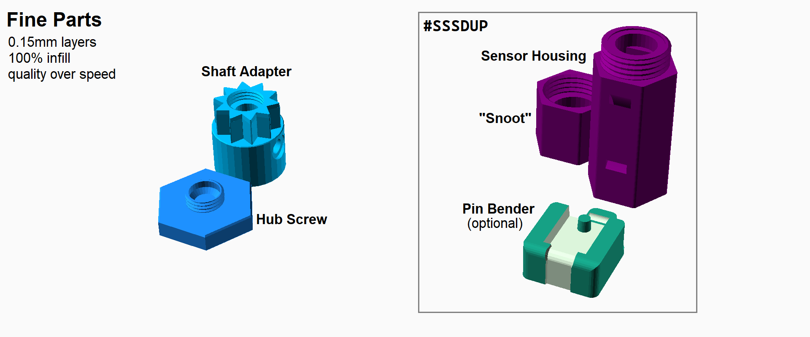

### Prepare the Reindeer Motor (`#SSSDAC` only)

- [ ] Confirm the motor turns clockwise and does not auto-reverse if obstructed.
- [ ] Remove any crank or hub that came with the motor.

> Tip:  Retain the shaft screw for later.  If you need to replace it, use an M4×10mm machine screw.

- [ ] Remove the screws from the four mounting posts.

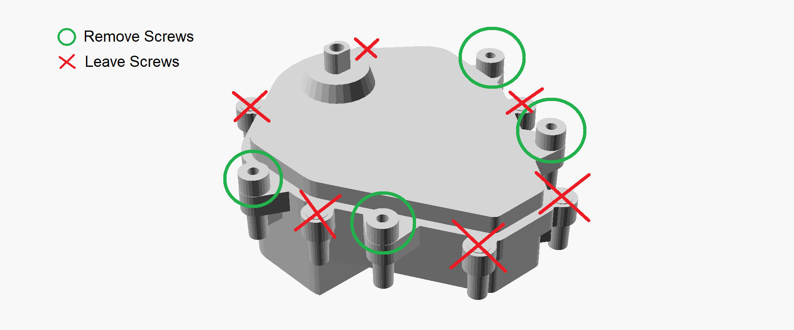

### Prepare the DC Motor (`#SSSDDC` or `#SSSDUP`)

- [ ] Temporarily connect 12 volts DC to the terminals of the motor.
- [ ] If it turns counterclockwise, reverse the polarity.
- [ ] If it turns clockwise, mark the terminal connected to the positive (red) wire.
- [ ] Disconnect the motor from the power.
- [ ] Slip ~25&nbsp;mm (1&nbsp;inch) of heat-shrink tubing over the pigtail wires.  Do not shrink it yet.
- [ ] Slip ~10&nbsp;mm (3/8&nbsp;inch) of heat-shrink tubing onto each of the pigtail wires.
- [ ] Strip about ~5&nbsp;mm (3/16&nbsp;inch) from the red wire and solder it to the marked terminal.
- [ ] Strip ~5&nbsp;mm (3/16&nbsp;inch) from the black wire and solder it to the other terminal.
- [ ] Shrink the individual tubes over the exposed connections.
- [ ] Shrink the larger tubing so that the center of it is ~75&nbsp;mm (3&nbsp;inches) from the connector.

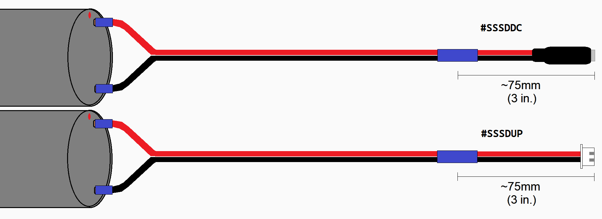

### Attach the Shaft Adapter

- [x] Install the appropriate nut or heat-set insert into the side of the shaft adapter.
- [x] Screw an M3×6mm screw just far enough to engage the threads.
- [x] If your motor's shaft is flattened on two sides, repeat the previous steps.

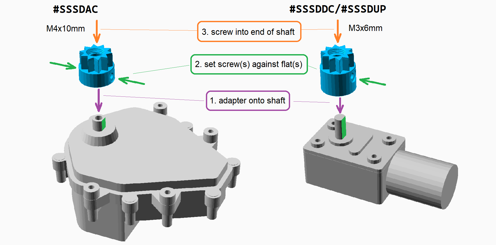

- [ ] Slip the shaft adapter over the motor shaft as far down as it will go.
- [ ] Align the set screw(s) with the flat side(s) of the motor shaft and tighten.
- [ ] Screw the shaft screw through the top of the adapter and into the end of the shaft.  

### Install the Motor

- [ ] Place the build plate on the motor and attach with four screws as shown.

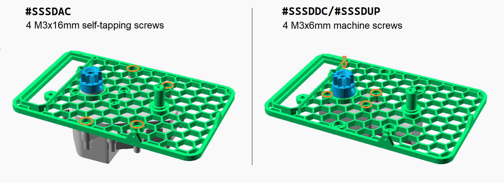

### Solder the Slightly Smarter Circuit (`#SSSDUP` only)

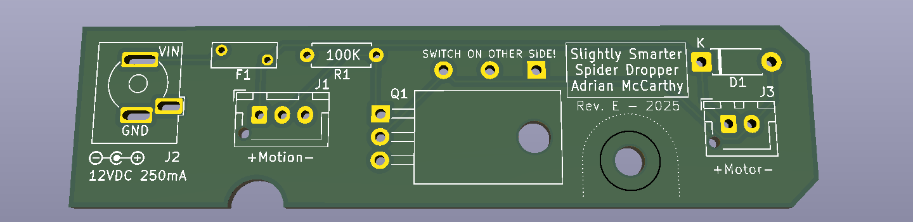

> Tip: Use the pin bender (`#3D`) to bend the leads of the resistor, diode, and MOSFET.

- [ ] Solder the 100KΩ resistor (brown/black/yellow) at R1.
- [ ] Solder the 1N4001 diode at D1 with the striped end as marked on the board.
- [ ] Trim the excess leads.
- [ ] Carefully bend the legs of the MOSFET back by 90° and then solder the MOSFET at Q1.

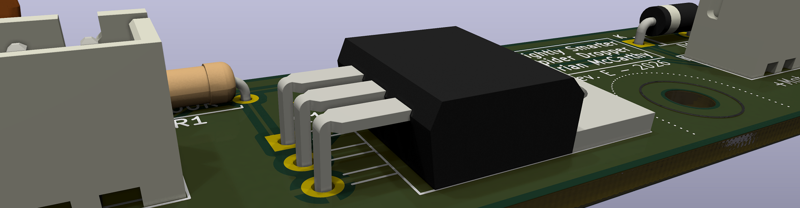

- [ ] Solder the 3- and 2-pin JST XH connectors at J1 and J3, respectively. Orient per the board markings.
- [ ] Solder the PTC fuse at F1, being careful not to overheat it.
- [ ] Trim the excess leads.
- [ ] Solder the barrel connector at J1.

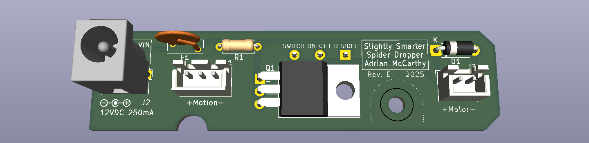

- [ ] Solder the microswitch into position on the opposite side of the board.

> Tip:  Use the soldering jig (`#3D`) to hold the microswitch in place while soldering.  Place the switch on the board and slip the jig over it. With the board flush with the jig, turn them both over and set it flat on your worksurface. Solder one terminal of the switch while applying some downward pressure to keep the board against the jig and the switch pressed.  Check that the switch is straight before soldering the other two terminals.

 
Note:  The lever of the switch is smaller than shown in the illustration above.

### Attach the Circuit Board (`#SSSDUP` only)

- [ ] Place the circuit onto the base plate with the components on the motor side and the switch on the axle side.
> Tip:  Match the triangular arrow printed on the board to the one embossed on the build plate to get the correct orientation.  Slide that edge of the board under the lip first.

- [ ] Secure the circuit board with an M3×6mm screw at H1 and a square nut in the pocket underneath.

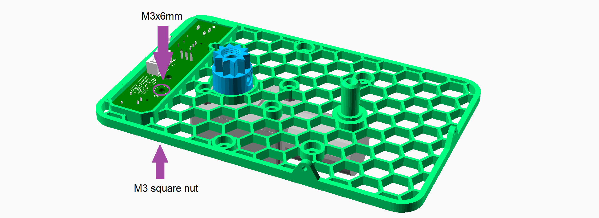

- [ ] Plug the motor pigtail into the 2-pin connector on the circuit board.
- [ ] Secure the pigtail to the base plate with a small zip tie as shown.

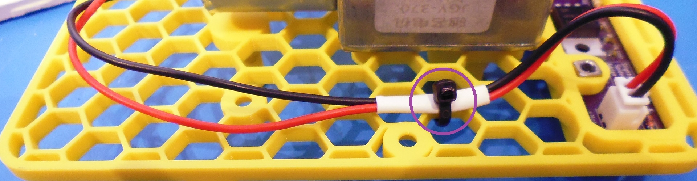

### Make the Sensor Cable (`#SSSDUP` only)

- [x] Remove ~50&nbsp;mm (2&nbsp;inches) of the jacket from one end of the cable.
- [x] Strip ~2&nbsp;mm from the tips of each of the exposed wires.
- [x] Crimp the JST XH pins (female) onto the wires.
- [x] Insert the pins into the JST XH housing in **RED/YELLOW/BLACK** order, with RED next to the notch in the housing.
- [x] Slide ~25&nbsp;mm (1&nbsp;inch) of heat-shrink tubing over the cable and shrink it ~75&nbsp;mm (3&nbsp;inches) from the connector.

- [x] Remove ~25&nbsp;mm (1&nbsp;inch) of the jacket from the other end of the cable.
- [x] Strip ~2&nbsp;mm from the tips of each of the exposed wires.
- [x] Crimp the Dupont-style pins (female) onto the wires.  Do not put them into the connector housing yet.
- [x] Slide ~25&nbsp;mm (1&nbsp;inch) of heat-shrink tubing over the cable and shrink it ~50&nbsp;mm (2&nbsp;inches) from the tips of the pins.

### Connect the Motion Sensor (`#SSSDUP` only)

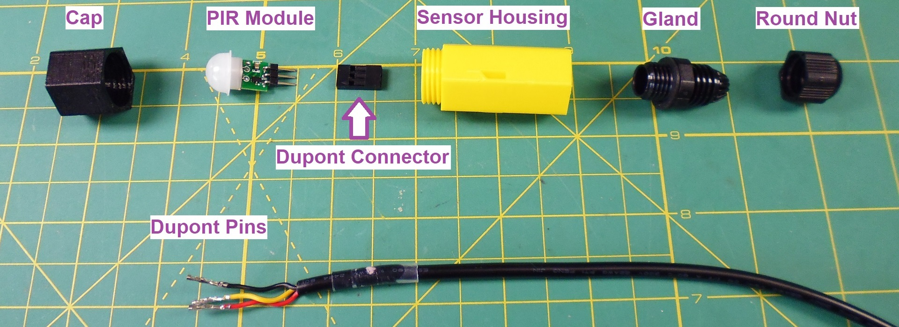

- [ ] Remove the flat nut from the cable gland.  You won't need it.
- [ ] Screw the gland into the back of the 3D-printed sensor housing.

> Tip:  Tighten and loosen the gland to the housing a few times to clear out the threads.

- [ ] Remove the round nut from the cable gland.
- [ ] Slip the Dupont pins into the rounded end and let the nut slide up the cable.
- [ ] Feed the Dupont pins into the gland.

> Tip:  Be careful not to dislodge the rubber seal held at the tips of the fins in the cable gland.

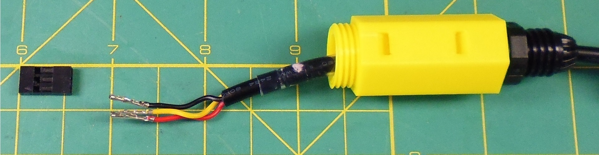

- [ ] When the pins extend out the top of the sensor housing, insert them into the Dupont connector body in **RED/YELLOW/BLACK** order.

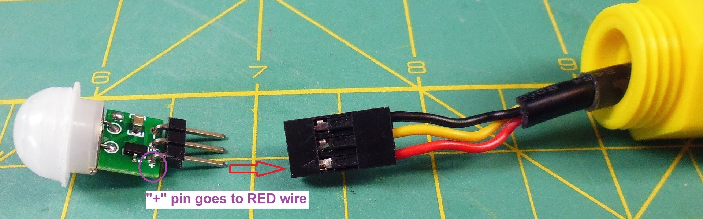

- [ ] Insert the PIR sensor module into the Dupont connector, ensuring that the pin marked **`+`** or **`VIN`** corresponds to the **RED** wire.

> Tip:  If the dome pops off the PIR module, be careful not to touch the exposed sensor.  Replace the dome and hold it in place until the module is secured in the housing.

- [ ] Push gently on the dome of the PIR module until the brim is flat against the rim of the housing.

> Tip:  You'll need to guide the excess cable out through the gland as you push the sensor into the housing, but do not pull the cable so hard that it could pull the connector from the sensor module.

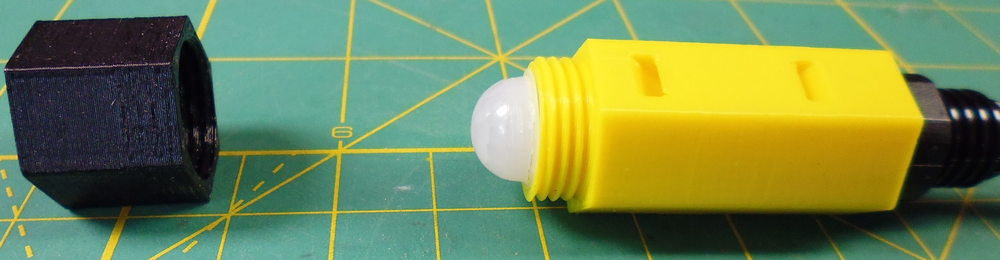

- [ ] Screw the cap onto the sensor housing.  When tightened, it pinches the brim of the dome, holding the module secure inside the housing.
- [ ] Hand tighten the round nut onto the cable gland.

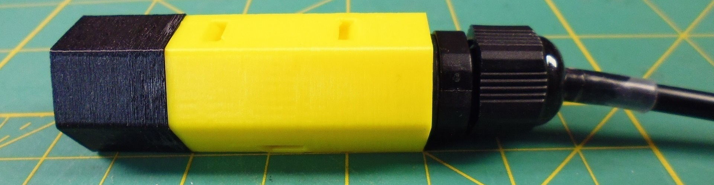

- [ ] Set the sensor cable aside for now.

### Install the Spool

- [ ] Place one bearing on a strong, flat surface.
- [ ] Position the wide face of the spool over the bearing and press down firmly until the bearing is inside the bore.
- [ ] Repeat with the second bearing.

> Note: Both bearings should be aligned and flush with the spool at both ends of the bore.  If not, you can use the bearing tool (`#3D`) to pop the bearings out and try again.

- [ ] Slide the spool onto the axle so that the wider part is closer to the base plate.
- [ ] Check that the spool can spin and that it doesn't wobble or rub the plate.

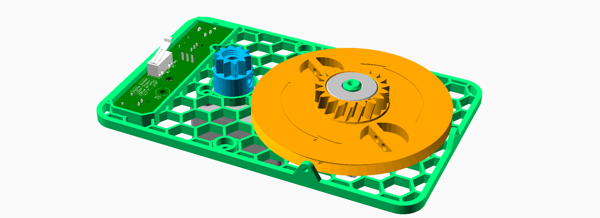

### Install the Drive Gear

- [ ] Press the drive gear onto the shaft adapter so that the toothless section is closest to the small gear of the spool.
- [ ] Confirm that the flat surface of the gear is flush with the top of the shaft adapter.
- [ ] Turn the spool and confirm it doesn't rub against the drive gear.
- [ ] Screw the hub screw into the shaft adapter and hand tighten.

> Note: The hub screw ensures the drive gear won't work its way off the shaft adapter, and the drive gear, in turn, ensures the spool won't work off of its axle.

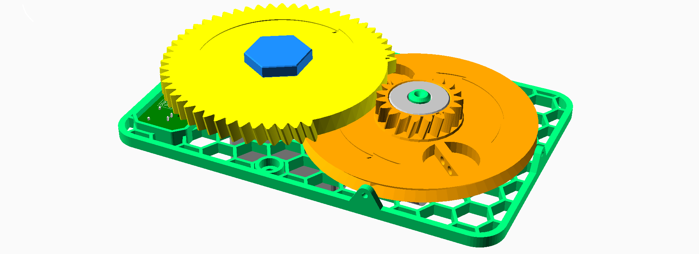

### Attach the Monofilament (Fishing Line)

The base plate has two string guides at the edges near the spool.  Decide whether you will hang the mechanism horizontally or vertically.  You will use the guide that's below the spool when hanging.

- [ ] Feed one end of the monofilament through the guide toward the spool.
- [ ] Thread the monofilament into one of the holes along the edge of the spool.
- [ ] Loop the monofilament through the two holes in the bar that divides the recess.
- [ ] Tie the line to itself.
- [ ] Trm the excess and ensure the knot remains entirely within the recess.

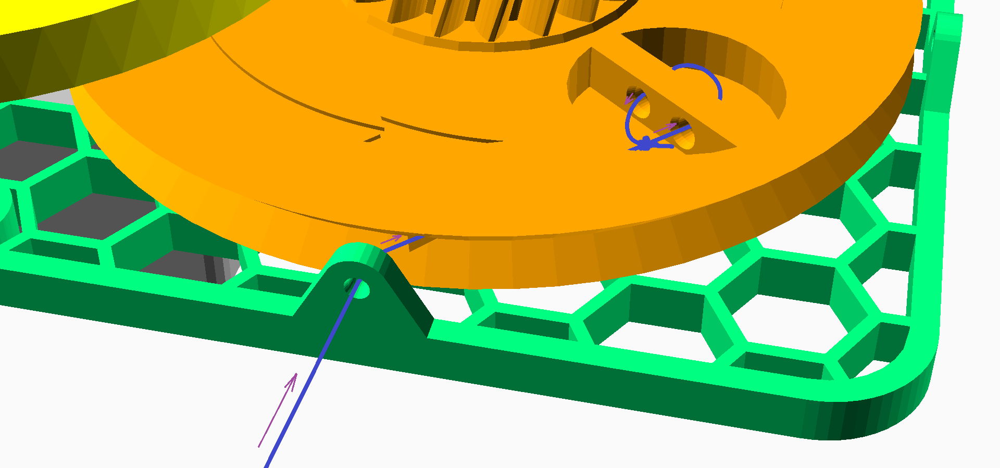

### Prepare the Spider

To make the toy spider hang realistically ...

- [ ] Trim a short zip tie about 12 mm (1/2 inch) down from the end with the loop.
- [ ] Select a drill bit that's about as wide as the zip tie.
- [ ] Carefully drill a hole in the back of the spider's abdomen (near the spinnerets) and toward its center of mass.  The hole needn't be deeper than the trimmed zip tie is long.
- [ ] Dip the zip tie in a blob of hot glue (use the black "cosplay" glue if you can).
- [ ] Insert the zip tie into the hole so that only the loop protrudes.  Ideally the glue should fill any gap between the zip tie and the sides of the hole.
- [ ] Allow the hot glue to cool, then check that the zip tie is secure.

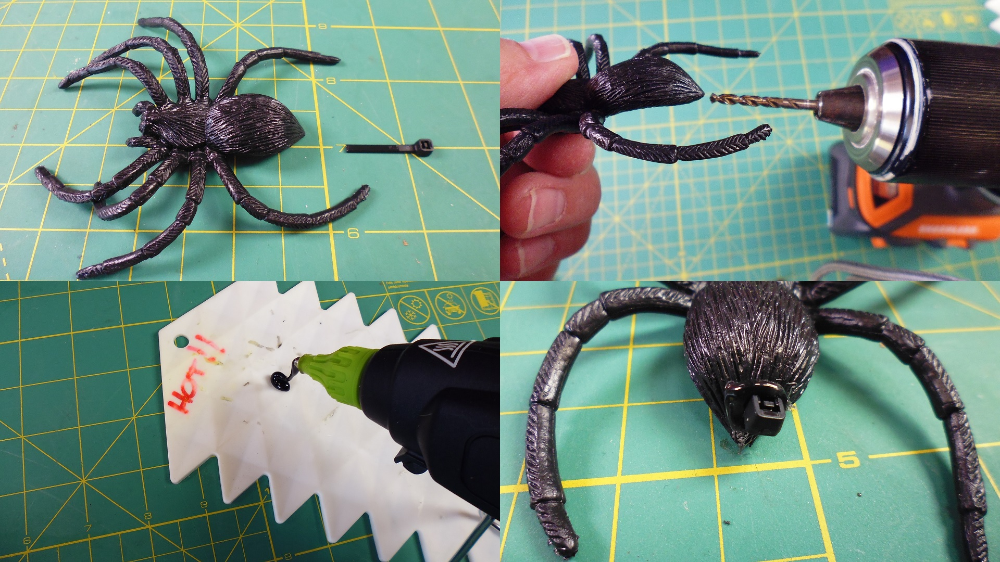

> Tip:  It's a great time to paint and/or flock your spider.

### Attach the Spider

There must be at least 24 inches (610 mm) of line between the bottom of the string guide and the point where the spider is tied.

- [ ] Tie the free end of the monofilament to the spider through the loop in the zip tie.
- [ ] Keeping some tension on the string, wind the spool 2.5 revolutions in the direction shown by the arrows.  If the spider reaches the guide before you complete the turns, the spider was tied too high.
- [ ] Trim the excess monofilament.

### Final Connections (`#SSSDUP` only)

- [ ] Plug the sensor into the 3-pin connector on the circuit board.
- [ ] Use a small zip tie to secure the cable to the base plate as shown.

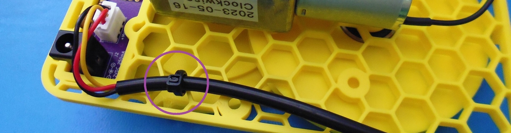

### Test the Mechanism

- [ ] Check the alignment by viewing the mechanism from the edge, as shown.

- [ ] Hang the mechanism from above with two zip ties, as shown.

- [ ] Allow the spool to fully unwind and the spider to dangle.
- [ ] Connect the power.

`#SSSDAC`/`#SSSDDC`:  The spider should rise and then drop suddenly.  The cycle should repeat continuously.

`#SSSDUP`:  The spider should rise to its highest point, and then stop until the sensor detects motion.  When that happens, the spider will drop suddenly and then rise again.

- [ ] Confirm the line winds in an orderly fashion around the spool.
- [ ] Confirm the drive gear doesn't rub against the spool.
- [ ] Confirm the spider drops the full amount.
- [ ] Allow the mechanism to run for several cycles to ensure it is not prone to jamming.

## Happy Haunting

Congratulations!  You've completed assembly of the Stupidly Simple Spider Dropper.

Consult the User Guide to learn how to set up and operate your spider dropper safely.
