# Stupidly Simple Spider Dropper Assembly Instructions

Adrian McCarthy 2026 for the [Northern California Haunters Group](https://www.norcalhaunters.com/)

Source files and documentation available at https://github.com/aidtopia/spider_dropper.

## Three Models

Make sure you know which model you are building.  Much of the assembly is the same for all three, but instructions specific to certain models will be tagged.

| Model                            |   Tag     |  Motor   |     Effect       | Soldering |
| :------------------------------- | :-------: | :------: | :--------------: | :-------: |
| Stupidy Simple Spider Dropper AC | `#SSSDAC` | reindeer |    continuous    |   none    |
| Stupidy Simple Spider Dropper DC | `#SSSDDC` |  12V DC  |    continuous    |  2 wires  |
| SSSD w/ Slightly Smarter Upgrade | `#SSSDUP` |  12V DC  | motion triggered |  circuit  |

## Safety

* This kit contains small parts that could pose a choking hazard.
* Some parts may contain lead and/or other toxic substances.  Wash hands after handling.
* Soldering irons, heat guns, and other tools used in assembly have their own risks.  Take appropriate precautions.
* Children should assemble or use the spider dropper only under adult supervision.
* Intended for indoor use.
* For the DC models, use an ETL- or UL-listed 12 volt DC power adapter with a current rating of at least 250 mA.
* Refer to the User Guide for important precautions regarding the setup and operation of the spider dropper.
* Disposal:  The circuit board and soldered components, including the PIR motion module, should be treated as e-waste.  The printed parts _may_ be recyclable but few collection programs will accept them.

## Tools

| Tool                           | `#SSSDAC` | `#SSSDDC` | `#SSSDUP` |
| :----------------------------- | :-------: | :-------: | :-------: |
| #1 phillips screwdriver        |           | required  | required  |
| #2 phillips screwdriver        | required  |           |           |
| small wire cutter              | required  | required  | required  |
| soldering iron                 |           | required  | required  |
| wire stripper                  |           | required  | required  |
| heat gun (heat-shrink tubing)  |           |recommended|recommended|
| needle nose pliers or tweezers |recommended|recommended|recommended|
| crimping pliers (Dupont)       |           |           | required\*|
| crimping pliers (JST XH)       |           |           | required\*|
| small adjustable wrench        |           |           |recommended|
| bearing removal tool `#3D`     | optional  | optional  | optional  |
| soldering jig `#3D`            |           |           | optional  |
| measuring tape or ruler        |recommended|recommended|recommended|
| drill with 1/8" (3mm) bit      |recommended|recommended|recommended|
| hot glue gun (w/ black glue)   |recommended|recommended|recommended|

Tools tagged with `#3D` are ones you can print with a 3D printer.  (Subject to change in California pending AB 2047.)

\* **Norcal Haunters:** Crimping pliers are not required for Make & Take kits.

## Parts

For detailed specifications and possible sources for the parts, check the spreadsheet in the project repository on Github.

| Part                           | `#SSSDAC` | `#SSSDDC` | `#SSSDUP` |
| :----------------------------- | :-------: | :-------: | :-------: |
| motor                          | reindeer  |  JGY-370  |  JGY-370  |
| shaft adapter `#3D`            |    7mm    |    6mm    |    6mm    |
| 2-wire motor "pigtail"         |           |  barrel   |  JST XH   |
| [M3 threaded insert](#threaded-inserts) | 1 |    1     |     1     |
| M3×16mm sheet metal screws     |     4     |           |           |
| M3×6mm machine screws          |     2     |     6     |     7     |
| base plate `#3D`               |     1     |     1     |     1     |
| spool assembly `#3D`           |     1     |     1     |     1     |
| 608 (skateboard) bearing       |     2     |     2     |     2     |
| drive gear `#3D`               |     1     |     1     |     1     |
| hub screw `#3D`                |     1     |     1     |     1     |
| fishing line (3+ feet)         |     1     |     1     |     1     |
| toy spider                     |     1     |     1     |     1     |
| M3 square nut                  |           |           |     1     |
| small zip ties                 |     1     |     2     |     2     |
| medium zip ties (for hanging)  |     2     |     2     |     3     |
| 12VDC power supply             |           | not incl. | not incl. |

Parts tagged `#3D` are ones you can print with a 3D printer.  (Subject to change in California per AB 2047.)

#### Threaded Inserts

There are three options for the threaded insert.  You must match the insert type to the shaft adapter type.  (Note that `#SSSDUP` requires one M3 square nut in addition to whichever inserts are used for the shaft adapter.)

| Threaded Insert                        | Notes                       |
| :------------------------------------- | :-------------------------- |
| M3×5mm heat-set theaded insert         | Necessary for heavier props |
| M3 _thin_ square nut (~1.8mm thick)    | Preferred over _regular_    |
| M3 _regular_ square nut (~2.4mm thick) | OK for toy spider           |

**Norcal Haunters:**  Heat-set threaded inserts have been pre-installed in the shaft adapters in the Make & Take kits.

### Additional Parts (`#SSSDUP` only)

The Slightly Smarter upgrade adds a circuit board and sensor.

| Qty | Circuit Part                    | | Qty | Sensor Part                |
| --: | :------------------------------ |-| --: | :------------------------- |
|   1 | Slightly Smarter circuit board  | |   1 | mini PIR motion sensor     |
|   1 | PJ-044AH barrel connector       | |   1 | PIR housing `#3D`          |
|   1 | 250 mA PTC resettable fuse      | |   1 | PIR cap (snoot) `#3D`      |
|   1 | 100K-ohm resistor               | |   1 | PG7 cable gland            |
|   1 | 1N4001 diode                    | |   1 | 3-wire 22-26 AWG cable     |
|   1 | IRLZ3FN n-channel MOSFET        | |   3 | Dupont-style female pins   |
|   1 | 2-pin JST XH (male) connector   | |   1 | Dupont-style 3-pin housing |
|   1 | 3-pin JST XH (male) connector   | |   3 | JST XH header female pins  |
|   1 | ZX40E20C01 microswitch          | |   1 | JST XH 3-pin housing       |
|   1 | additional M3×5mm machine screw | |     |                            |
|   1 | additional M3 square nut        | |     |                            |

## Assembly

Perform the steps in order, using the checkboxes to keep track of your progress.  Remember to skip steps that are tagged for models other than the one you're building.

**Norcal Haunters:**  Some steps have been performed in advance in the Make & Take kits, so those checkboxes have been pre-checked.

### Print the Printable Parts

The project source files on GitHub include the OpenSCAD sources for generating the 3D models as STL files.  The pre-generated models will be available on Printables. [TODO]

The 3D parts are designed to be printed with a 0.4&nbsp;mm nozzle without supports.  They've all been tested with Prusa MK3S+ and CORE One+.  PLA works fine, but prefer PETG for a more durable mechanism.  You probably want to choose black or another dark color.  Illustrations here use brighter colors for clarity.

- [x] Print the coarse parts (layer height 0.2&nbsp;mm to 0.3&nbsp;mm)

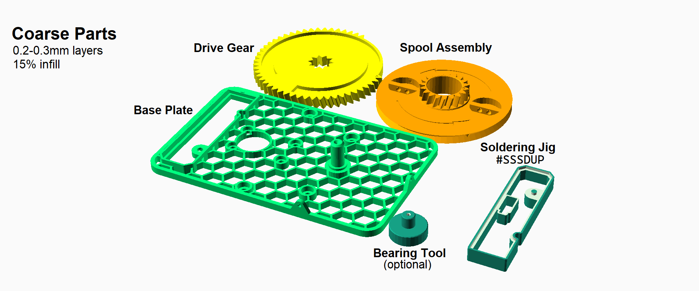

- [x] Print the fine parts (layer height 0.15&nbsp;mm, 100% infill, quality over speed)

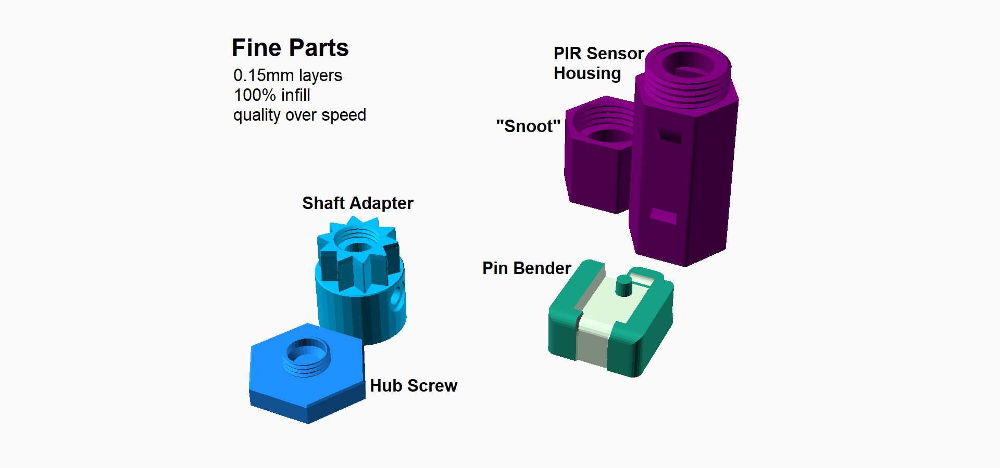

### Prepare the Motor

#### Prepare the Reindeer Motor (`#SSSDAC`)

- [ ] Plug in the reindeer motor.
- [ ] Confirm it turns clockwise and does not auto-reverse if obstructed.
- [ ] Unplug the motor.
- [ ] Remove any crank or hub that came with the motor.

> Tip:  Retain the shaft screw for later.  If your motor is missing the shaft screw, you'll need an M4x10mm machine screw.

- [ ] Remove the screws from the four mounting posts.

> Tip:  The mounting posts look very similar the ones used to hold the motor housing clamped shut.  Be careful to remove only the screws from the mounting posts.

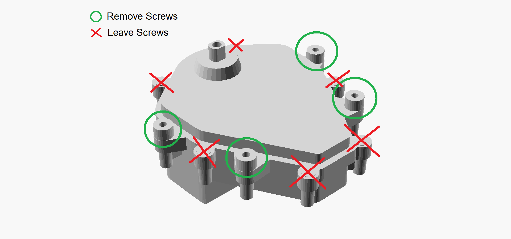

#### Prepare the DC Motor (`#SSSDDC` or `#SSSDUP`)

- [ ] Temporarily connect 12 volts DC to the terminals of the motor.
- [ ] If it turns counterclockwise, reverse the polarity of the power.
- [ ] If it turns clockwise, mark the terminal connected to the positive (red) wire.
- [ ] Disconnect the motor from the power.

> Note:  Some motor manufacturers mark one terminal with a red dot, but that's not always reliable for this project.  Double check using the steps above.

- [ ] Slip an approximately 25 mm (1 inch) length of heat-shrink tubing over the pigtail wires.  Do not shrink it yet.
- [ ] Slip a short length of heat-shrink tubing onto each of the pigtail wires.
- [ ] Strip about 5 mm (3/8 inch) from the red wire and solder it to the marked terminal.
- [ ] Strip about 5 mm (3/8 inch) from the black wire and solder it to the other terminal.
- [ ] Slide the individual tubes over the exposed connections and shrink them down.
- [ ] Slide the larger tubing so that the center of it is about 75 mm (3 inches) from the connector and shrink it down.

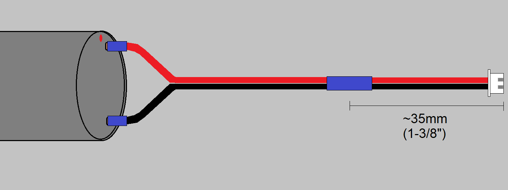

### Attach the Shaft Adapter

- [ ] Test fit the 3D-printed hub screw in the top of the adapter to break out any imperfections with the threads.
- [x] Insert nut(s) or heat-set insert(s) into the shaft adapter.
- [x] If your motor's shaft is flattened on two sides, repeat the previous step.
- [x] Insert M3×6mm screw(s) partway into the adapter.
- [ ] Slip the shaft adapter over the motor shaft as far down as it will go.
- [ ] Rotate the adapter until the set screw is perpendicular to the flat side of the motor shaft.
- [ ] Tighten the set screw(s) against the shaft as tightly as you can with a manual screwdriver.  Ensure the shaft adapter remains all the way down on the shaft as you tighten.

> Note:  The set screws ensure the adapter rotates with the motor shaft.  In the next step, you'll install a shaft screw to ensure the adapter doesn't work its way off the end of the shaft.

#### For the Reindeer Motor (`#SSSDAC`)

- [ ] Insert the shaft screw you retained earlier through the top of the adapter and screw into the end of the motor shaft.  If you don't have the original shaft screw, you can substitute an M4×10mm.

#### For the DC Motor (`#SSSDDC` or `#SSSDUP`)

- [ ] Insert an M3×6mm machine screw through the top of the adapter and screw it into the end of the motor shaft.

### Install the Motor

- [ ] With the motor shaft pointing up, slip the base plate over the motor so the shaft adapter passes through the largest hole.
- [ ] Align the motor mounting holes on the base plate with the ones on the motor.

#### For the Reindeer Motor (`#SSSDAC`)

- [ ] Use 4 M3×16mm self-tapping screws to attach the motor to the base plate.

> Tip:  Work carefully and screw them in slowly while applying firm pressure.  Repeated insertions of the self-tapping screws will wear out the plastic.

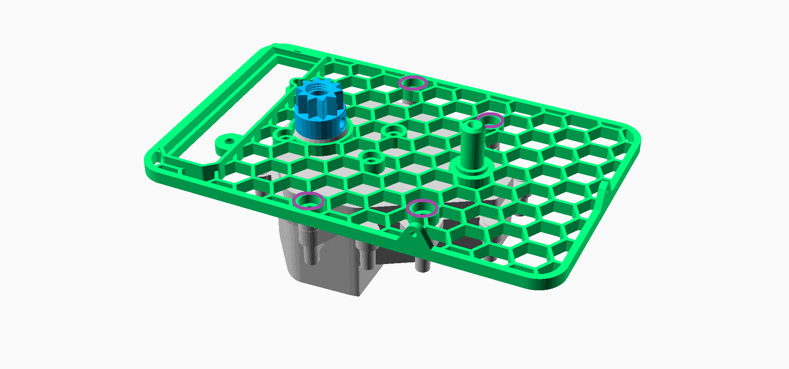

#### For the DC Motor (`#SSSDDC` or `#SSSDUP`)

- [ ] Use 4 M3×6mm machine screws to fasten the motor to the base plate.

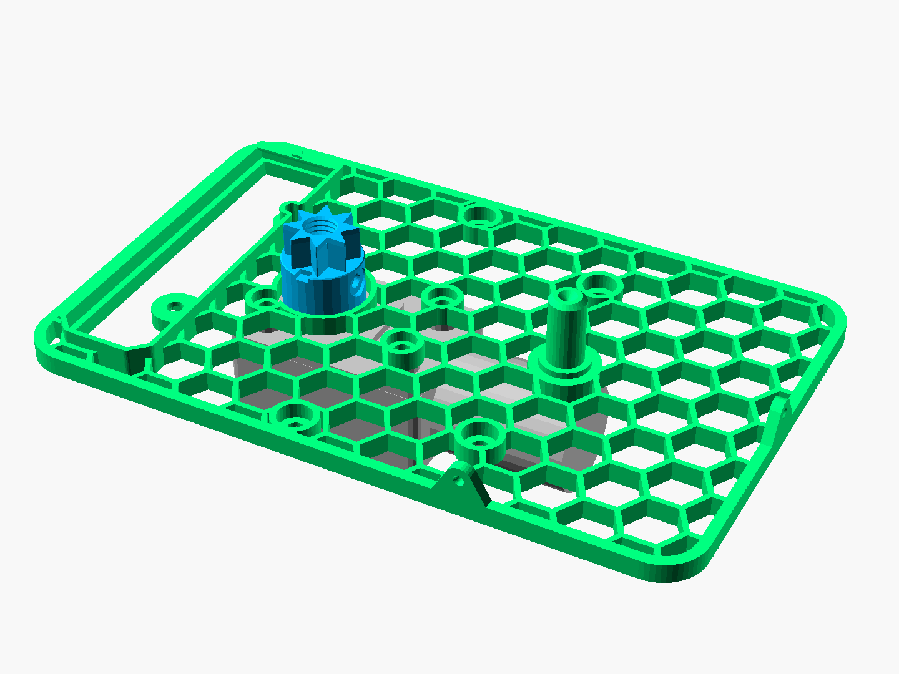

### Solder the Slightly Smarter Circuit (`#SSSDUP` only)

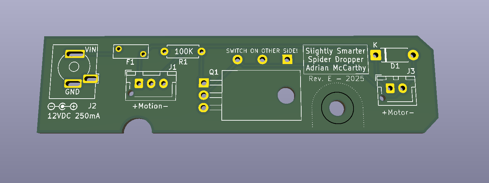

> Tip: Use the pin bender (`#3D`) for the leads of the resistor and diode.

- [ ] Solder the 100KΩ resistor (brown/black/yellow) at R1.
- [ ] Solder the 1N4001 diode at D1 with the striped end as marked on the board.
- [ ] Trim the excess leads.

> Tip: Use the pin bender (`#3D`) to bend the legs of the MOSFET.

- [ ] Carefully bend the legs of the MOSFET back by 90° and then solder the MOSFET at Q1.

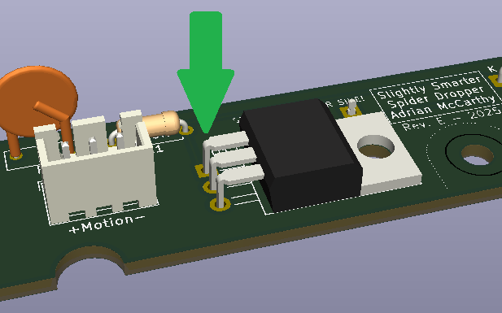

- [ ] Solder the 3- and 2-pin JST XH connectors at J1 and J3, respectively. Match the orientation to the markings on the board.
- [ ] Solder the PTC fuse at F1, being careful not to overheat it.
- [ ] Trim the excess leads.
- [ ] Solder the barrel connector at J1.

> Note: The microswitch will be installed on the opposite side of the board from all the other components.  It must be positioned flat against the board with the lever toward the middle of the board as indicated.

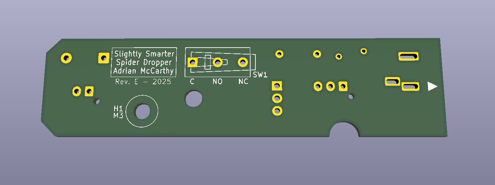

- [ ] Solder the microswitch into position.

> Tip:  Use the soldering jig (`#3D`) to hold the microswitch in the correct position while soldering.  Fit the switch into position on the board and slide the jig over it until the board is flush with the jig.  Turn them both over so the jig is beneath the board and set it flat on your worksurface. Solder one terminal of the switch while applying some downward pressure to keep the board against the jig and the switch lever compressed.  Check that the switch is straight and parallel before soldering the other two terminals.

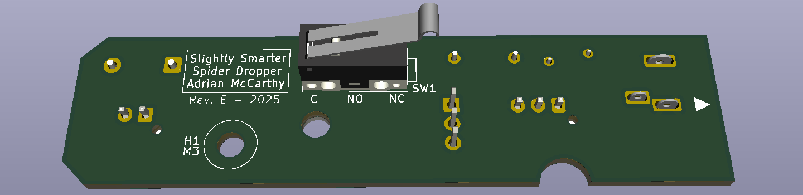 
Note:  The lever of the switch is smaller than shown in the illustration above.

### Attach the Circuit Board (`#SSSDUP` only)

- [ ] Place the circuit onto the base plate with the components on the motor side the switch on the axle side.
> Tip:  Match the triangular arrow printed on the board to the one embossed on the build plate to get the correct orientation.  Slide that edge of the board under the lip first.

- [ ] Secure the circuit board with an M3×6mm screw at H1 and a square nut in the pocket underneath.

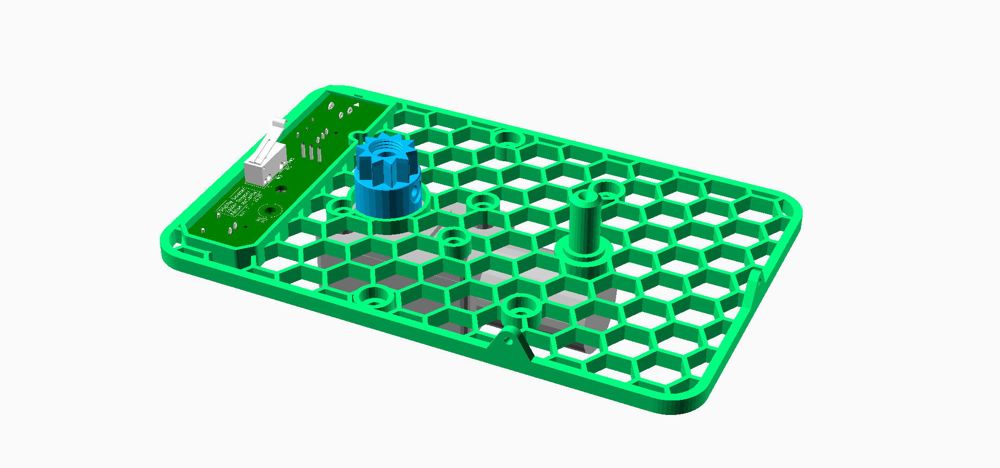

- [ ] Plug the motor pigtail into the 2-pin connector on the circuit board.
- [ ] Use a small zip tie to secure the pigtail to the base plate as shown. TODO

### Make the Sensor Cable (`#SSSDUP` only)

**Norcal Haunters**:  The Make & Take kits have pre-made sensor cables.  You're welcome.

- [x] Remove about 25 mm (1 inch) of the jacket from one end of the cable, being careful not to nick the insulation on the wires inside.
- [x] Strip about 2 mm from the tips of each of the exposed wires.
- [x] Crimp the JST XH pins (female) onto the wires.
- [x] Insert the pins into the JST XH housing in **RED/YELLOW/BLACK** order, starting with RED closest to the notch in the housing.
- [x] Slide an approximately 25 mm (1 inch) length of heat-shrink tubing over the cable and shrink it down approximately 75 mm (1-3/8 inch) back from the JST connector.
- [x] Remove about 25 mm (1 inch) of the jacket from the other end of the cable.
- [x] Strip about 2 mm from the tips of each of the exposed wires.
- [x] Crimp the Dupont-style pins (female) onto the wires.  Do not put them into the connector housing yet.
- [x] Slide another 25 mm (1 inch) length of heat shrink tubing over the cable and shrink it down approximately 50 mm (2 inches) 1- to 2-inch section of heat shrink tubing onto the cable from this end.

### Connect the Motion Sensor (`#SSSDUP` only)

- [ ] Remove the flat nut from the cable gland.  You won't need it.
- [ ] Screw the gland into the back of the 3D-printed sensor housing.

> Tip:  Tighten and loosen the gland to the housing a few times to clear out the threads.  A small adjustable wrench can be useful for holding the gland.

- [ ] Remove the round nut from the cable gland.
- [ ] Slip the Dupont pins into the rounded end and let the nut slide up the cable.
- [ ] Feed the Dupont pins into the gland.

> Tip:  Be careful not to dislodge the rubber seal held at the tips of the fins in the cable gland.

- [ ] When the pins extend out the top of the sensor housing, insert them into the Dupont connector body in **RED/YELLOW/BLACK** order, starting at either end.
- [ ] Insert the PIR sensor module into the Dupont connector, ensuring that the **pin marked `+` or `VIN` corresponds to the RED wire**.

> Tip:  If the dome pops off the PIR module, be careful not to touch the exposed sensor.  Replace the dome and hold it in place until the module is secured in the housing.

- [ ] Push gently on the dome of the PIR module until the brim is flat against the rim of the housing.

> Tip:  Do not pull the module into the housing from the cable, as that may loosen the connection.

- [ ] Screw the cap onto the sensor housing.  When tightened, it pinches the brim of the dome, holding the module secure inside the housing.
- [ ] Slide the round nut up the cable and back onto the cable gland and hand tighten.
- [ ] Set the sensor and cable aside for now.

### Install the Spool

- [ ] Place one bearing on a strong, flat surface.
- [ ] Position the wide face of the spool over the bearing and press down firmly until the bearing is inside the bore.
- [ ] Repeat with the second bearing.

> Note: Both bearings should be aligned and flush with the spool at both ends of the bore.  If not, you can use the bearing tool (`#3D`) to pop the bearings out and try again.

- [ ] Slide the spool onto the axle so that the wider part is closer to the base plate.
- [ ] Check that the spool can spin and that it doesn't wobble or rub the plate.

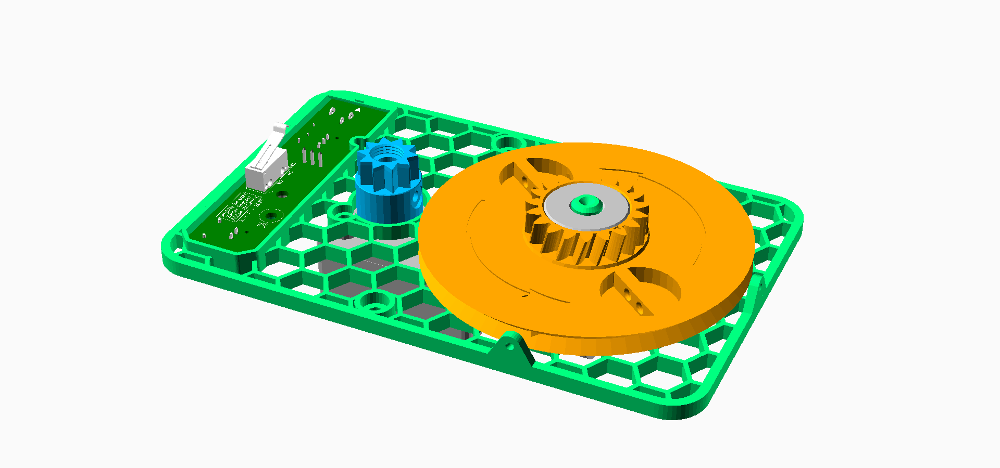

### Install the Drive Gear

- [ ] Press the drive gear onto the shaft adapter so that the arrows are on top, and the toothless section is closest to the small gear of the spool.
- [ ] Confirm that the flat surface of the gear is flush with the top of the shaft adapter.
- [ ] Turn the spool and confirm it doesn't rub against the drive gear.
- [ ] Screw the hub screw into the shaft adapter and hand tighten.

The hub screw ensures the drive gear won't work its way off of the shaft adapter, and the drive gear, in turn, ensures the spool won't work off of its axle.

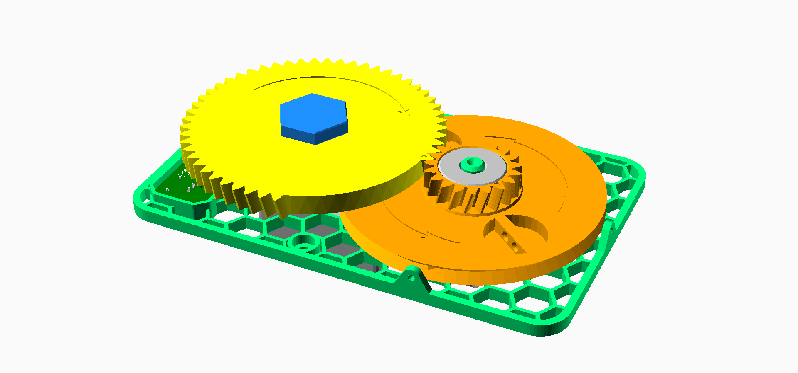

### Attach the Fishing Line

The base plate has two string guides at the edges near the spool.  Decide whether you will hang the mechanism horizontally or vertically.  You will use the guide that's below the spool when hanging.

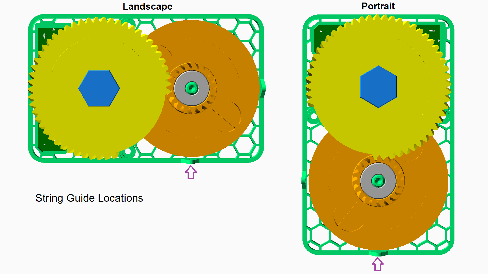

- [ ] Feed one end of the fishing line through the guide toward the spool.
- [ ] Thread the fishing line into one of the holes along the edge of the spool.
- [ ] Route the fishing line through one of the two holes in the bar that divides the recess.
- [ ] Route the line back through the other hole.
- [ ] Tie the line to itself.
- [ ] Ensure the string remains entirely within the recessed part of the spool.

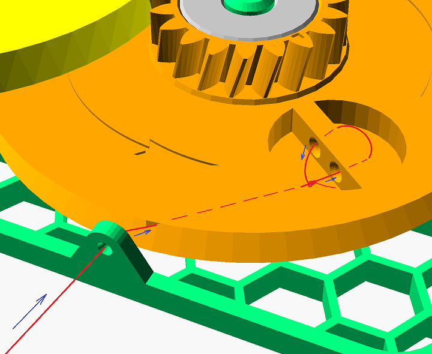

### Prepare the Spider

To make the toy spider hang realistically ...

- [ ] Trim a short zip tie about 12 mm (1/2 inch) down from the end with the loop.
- [ ] Select a drill bit that's about as wide as the zip tie.
- [ ] Carefully drill a hole in the back of the spider's abdomen (near the spinnerets) and toward its center of mass.  The hole needn't be deeper than the trimmed zip tie is long.
- [ ] Dip the zip tie in a blob of hot glue (use the black "cosplay" glue if you can).
- [ ] Insert the zip tie into the hole so that only the loop protrudes.  Ideally the glue should fill any gap between the zip tie and the sides of the hole.
- [ ] Allow the hot glue to cool, then check that zip tie is secure.

### Attach the Spider

There must be at least 24 inches (610 mm) of line between the bottom of the string guide and the point where the spider is tied.

- [ ] Tie the free end of the fishing line to the spider through the loop in the zip tie.
- [ ] Keeping some tension on the string, wind the spool 2.5 revolutions in the direction shown by the arrows.  If the spider reaches the guide before you complete the turns, the spider was tied too high.
- [ ] Trim the excess fishing line.

### Final Connections (`#SSSDUP` only)

- [ ] Plug the sensor into the 3-pin connector on the circuit board.
- [ ] Use a small zip tie to secure the cable to the base plate as shown. TODO

### Test the Mechanism

- [ ] Hang the mechanism from above with two zip ties, as shown.

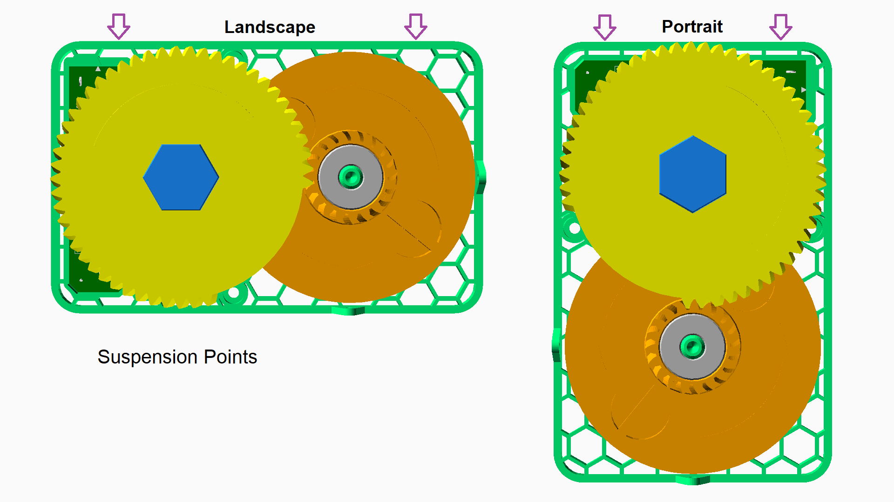

- [ ] Allow the spool to fully unwind and the spider to dangle.
- [ ] Connect the power.

`#SSSDAC` and `#SSSDDC`:  The spider should rise and then drop suddenly.  The cycle should repeat continuously.

`#SSSDUP`:  The spider should rise to its highest point, and then stop until the sensor detects motion.  When that happens, the spider will drop suddenly, and then rise again.

- [ ] Confirm the line winds in an orderly fashion around the spool.
- [ ] Confirm the drive gear doesn't rub against the spool.
- [ ] Confirm the spider drops the full amount.
- [ ] Allow the mechanism to run for several cycles to ensure it is not prone to jamming.

## Happy Haunting

Congratulations!  You've completed assembly of the Stupidly Simple Spider Dropper.

Please consult the User Guide for tips on setting up and operating the spider dropper in your haunt.  In particular, it has important information on avoiding and dealing with a jam.
