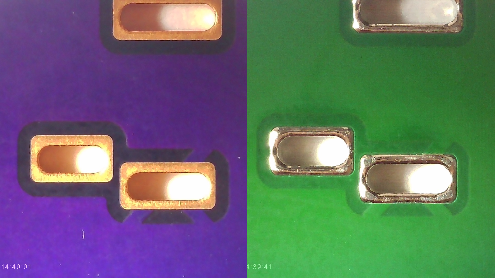
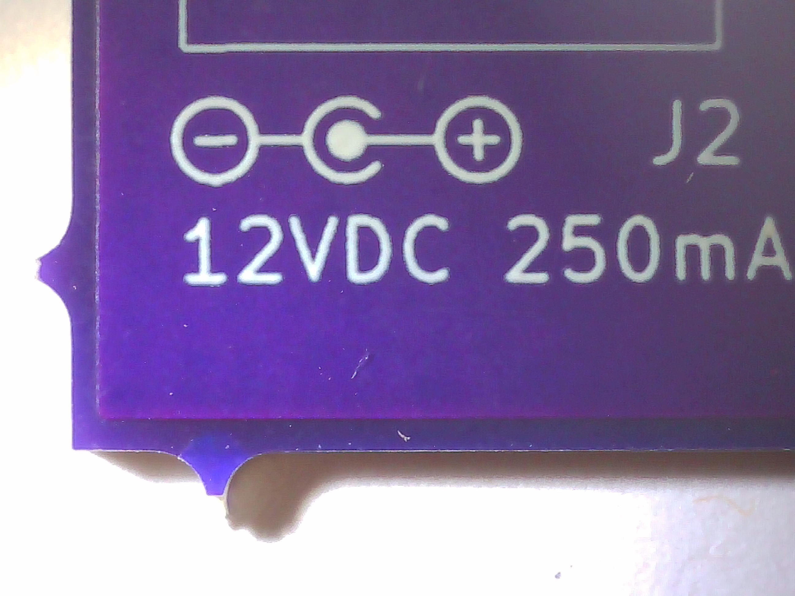
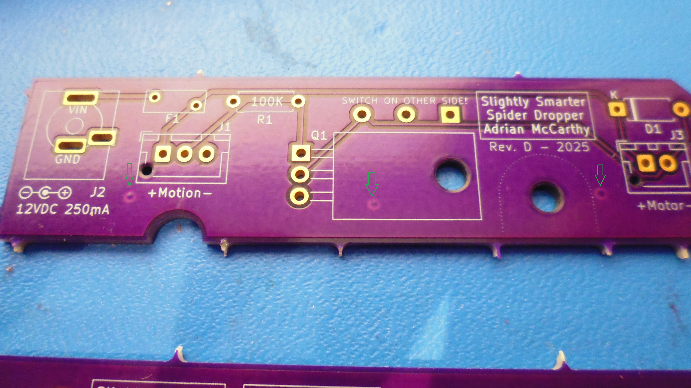
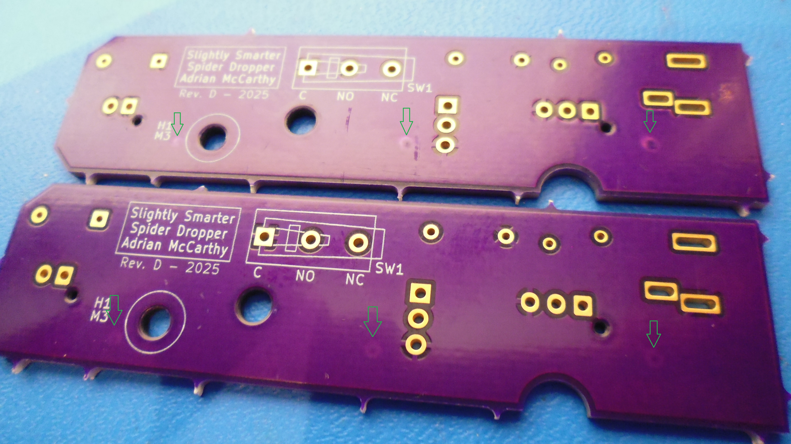

# OSH Park v. PCBWay

## Introduction

I ordered the same PCB design using both OSH Park and PCBWay.  The PCBs are basic 2-layer boards for through-hole components, measuring 80&nbsp;mm &times; 20&nbsp;mm (or, as OSH Park prefers to say, 3.15&nbsp;in. &times; 0.79&nbsp;in.).  These were prototypes, so I ordered the minimum number of boards from each manufacturer.

The orders were placed within one hour of each other near midnight on September 2, 2025.

## PCBs

The following characteristics of the boards are identical and perfect:

* The holes (positions and plating), including the slotted holes, are perfect and correct on all of the boards from both manufacturers.

* All of the silkscreening is flawless.

* The boards are the same thickness

### Solder Mask

OSH Park famously uses purple for the solder mask.  It's a nice deep purple that provides excellent contrast with the white silkscreen.  I didn't see any option to choose anything else in the order flow.

PCBWay defaults to green but offers several other colors.  Some are specialty colors that cost more, but I believe some of the basic colors don't cost any more than green.  I've never experimented with alternate colors.  Since the prototypes piggyback on panels with other customers' circuits, I've wondered whether choosing a less common color might introduce a delay until there are enough other orders for that color.

### Silkscreen

OSH Park doesn't add anything to the silkscreen.

Unless you pay an extra $1.50, PCBWay adds an 11-character product ID in tiny type to the silkscreen of your boards.  I believe the location of the ID number is chosen by a human to be discrete, and it may be possible to choose the location yourself.

On my boards, it's inside the footprint of the MOSFET, so it won't visible when the board is populated.

### Weight

I haven't put them on a scale, but the OSH Park boards feel ever so slightly heavier than the PCBWay ones.  They also feel a tiny bit less flexible.

### Surface Finish

The OSH Park boards have ENIG coating, which plates gold to the solder pads.

By default, the PCBWay boards have HASL with lead.  If you tick a box, you _might_ be upgraded to ENIG for no additional charge.  PCBWay offers several other choices, most of which, I assume, cost more.

### Edge Cuts

The OSH Park boards have very sharp spikes along the outer edges.  These are burrs left over from separating the boards from the rest of the panel.  (The connectors were called mousebites, which are sometimes used instead of a v-groove.)

Handling the boards is uncomfortable, and I plan to file these off before I assemble the boards.  Filing fiberglass releases tiny fibers, so that'll require a respirator.

The OSH Park boards are a tiny bit oversized.  In the 20 mm direction, they are over by 0.12 mm.  In the 80 mm direction, they are over by 0.08 mm.

The PCBWay boards have always arrived spike free.

The PCBWay boards measure just under the design size, by 0.02 mm (or less), in both the wide and narrow directions.

### Imperfections?

There are donut-shaped imperfections on some of the board surfaces from OSH Park.  They look like vias that have been covered with soldermask.  My design has no vias, the locations of these spots don't make any sense, and they don't protrude to the opposite side.  I can't tell whether there's actually a via there or whether it's just an artifact in the coatings.

On one board, the three donuts are quite clear on the front, but there's no sign of them on the back.

On the other two boards, three donuts appear in roughly the same pattern on the backs, but there's no sign of them on the fronts.

Although the arrangement in all three cases is about the same, they are not precisely the same.  I think, perhaps, these were made by some handling equipment on the manufacturing line before the soldermask was fully cured.

The PCBWay boards don't have any noticeable surface imperfections like these.

## Cost

| Item | OSH Park | PCBWay |
| ---- | -------: | -----: |
| Quantity Ordered | 3 | 5 |
| Price | $12.40 | $5.00 |
| Coupon | $0.00 | -$0.10 |
| Shipping | $0.00 | $27.27 |
| DTP Service | $0.00 | $7.00 |
| Bank Charge | $0.00 | $2.25 |
| Tariff | $0.00 | $8.00 |
| Total Cost | $12.40 | $49.42 |

### OSH Park

OSH Park produces three copies of a "prototype" PCB for $5 per square inch.

My design is 80&nbsp;mm &times; 20&nbsp;mm, which is 2.48&nbsp;square inches, and $5&nbsp;&times; 2.48&nbsp;= $12.40.

Since OSH Park manufactures in the U.S., there are no tariffs or duties.

### PCBWay

PCBWay charges $5 for 5 or 10 copies of a small PCB.

My previous PCBWay orders were tariff and duty-free because they were below the $800 _de minimus_.  President Trump eliminated the _de minimus_ exemption and (without constitutional authority) raised the tariff rates.

For this order, the tariffs and duties added to $8.  But that's not the only additional cost with the elimination of the exemption.  I also paid $7 for DHL's DTP Service.  (I believe DTP stands for Duties and Tariffs Prepaid.)  The DTP service transfers the prepaid tariff to the appropriate government department and handles the paperwork.  PCBWay's order flow has options to not prepay the tariff and to omit the DTP service, leaving it up to the customer to figure out how to pay the tariffs to get their order released from whatever port it arrives in.

The PCBWay bank charge is a new-to-me line item.  It applies whether you use a credit card or PayPal.  I assume this is a foreign transaction fee, possibly specific to China.

## Shipping and Speed

| Item | OSH Park | PCBWay |
| ---- | -------- | ------ |
| Origin | Lake Oswego, OR, U.S.A. | Shenzhen, Guangdong Province, China |
| Estimated Manufacturing Time | ? | 24 hours |
| Actual Manufacturing Time | 7 days | just over 24 hours |
| Shipping Service | USPS | DHL |
| Estimated Shipping Time | 5 business days | 5 business days |
| Actual Shipping Time | 3 days | 4 days |
| Order to Receipt | 10 days | 5 days |

### OSH Park

OSH Park used USPS Ground Advantage, which showed up in my mailbox with the regular mail.  USPS Ground Advantage can be tracked.  (_I_ never got a tracking number from OSH Park, but that's probably specific to the problem I had with OSH Park that most other users would not encounter.  See the next section for details.)

The boards arrived loose, clanging into each other inside a thin bubble envelope.  There was no paperwork, but the USPS shipping label has the OSH Park order code on it.

### PCBWay

The PCBWay order arrived in a nice (but oversized) cardboard box.  The box was sealed inside a plastic DHL wrapper (not pictured).  The boards themselves were stacked, wrapped in foam, and vacuum sealed inside a flat bag. The vacuum was tight enough that the boards could not slide around.  The flat bag was labeled with the order number and many details (date, layers, dimensions, gerber file name, etc.), and put in the box with a generous amount of foam packaging.

## Status and Support

| Item | OSH Park | PCBWay |
| ---- | -------- | ------ |
| Support | email with prompt replies | 24x7 live chat |
| Status Updates | problematic for me | email and online |

### OSH Park

After placing the OSH Park order, I decided to create an account.  That did not go well.

I had four email exchanges with their support department over two days.  They were prompt to respond, and I dealt with the same representative throughout.  He was polite and seemed to have actual insight and some authority to solve problems.

The first problem, according to the rep, was that the system automatically creates an account for you when you place your first order.  Supposedly it leaves to logged into this new account.  There's no indication of this in the user interface.  The order confirmation page still had a "Log In / Sign Up" link at the top, I'd never been asked to agree to a terms of service, and I was never prompted to create a password.  According to the rep, when I tried to create an account, it failed because I already had an account and, supposedly, I was already logged in.

But the root problem is that email sent by their automated systems fails to reach my email server, so I cannot receive an email verification link, an OTP, or a password reset link.  This probably isn't an issue for most users.  I've had this problem with a couple vendors in the past (notably Comcast and Verizon), whose important notices get dropped by a backhaul spam filter between them and my email service provider, even though all the marketing and support messages come through just fine.  Given that big email services (like Gmail) have direct connections to the network backbones (and thus deal with more of the spam directly), most users wouldn't encounter this problem.

This root problem also affected the status messages about my order.  I never received an order confirmation, a payment receipt, nor a tracking number.  The only messages I have from OSH Park are replies to my support request.

But even once I was logged in, I couldn't find my order.  After the boards actually arrived, I logged in again and now see my order.

Conclusion:  Support was very good.  The system has problems, but those are unlikely to affect most customers.

### PCBWay

Shortly after placing the PCBWay order, I realized I'd sent the wrong gerber files.  Using the live chat on the site, I was able to correct my mistake within minutes.  The support person paused my order, told me how to re-upload, sent confirmation that the correction had been made, and unpaused my order.  They were friendly and polite, with only a gentle admonishment in the email confirmation of the correction.

PCBWay sent email messages to confirm receipt of my order, my payment, and the upload of the correct gerber files.  They also emailed me the DHL tracking number when the package was shipped.  By logging into my PCBWay account, I could also see that status of my order, including details of what phase of manufacturing my board was in and a percentage of how far along my order was in the manufacturing process.  I can also review my previous orders, download PDFs of invoices, etc.

Conclusion:  Support was excellent.

## Conclusion

Previously, I have always chosen PCBWay for my hobby PCBs.  With rising shipping costs, elimination of the _de minimus_ exemption, and the addition of foreign transaction fees, it seemed worth considering a U.S. vendor.

OSH Park was the only U.S. vendor I knew of that seemed accessible to low-quantity hobbyists.  (Later, I was reminded of Digikey's DKRed service that sounds very similar to OSH Park's.)

I'm happy I tried the experiment.  I will certainly consider OSH Park (and perhaps DK Red) on a case-by-case basis.  I predict, however, I'll usually choose PCBWay because:

* PCBWay boards arrive in 5 to 7 days.  Even the luckiest OSH Park order cannot touch that.
* PCBWay boards do not require post processing to remove the spikey burrs.
* OSH Park's ENIG surface finish is a nice-to-have feature, but not a must-have.  If it ever became a must-have, I could pay a little more for PCBWay.
* For somewhat larger boards, the price gap shrinks substantially.
* As my ambitions grow, PCBWay has more options and services (e.g., assembly) available.
* PCBWay email reaches me, and support is via live chat.  OSH Park email doesn't reach me.  Perhaps that doesn't matter as much now that I can log in to my OSH Park account, but if I ever need to do a password reset, I'll have to work through support again.
