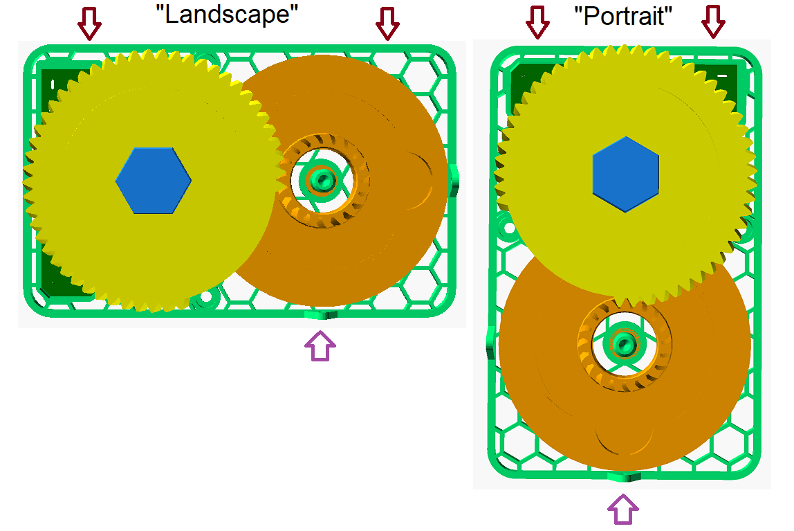
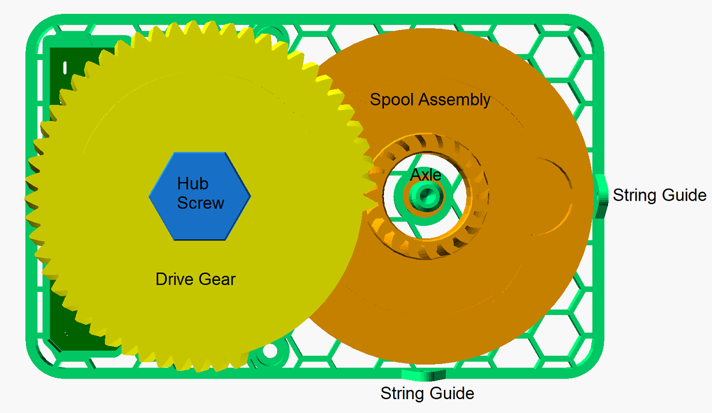
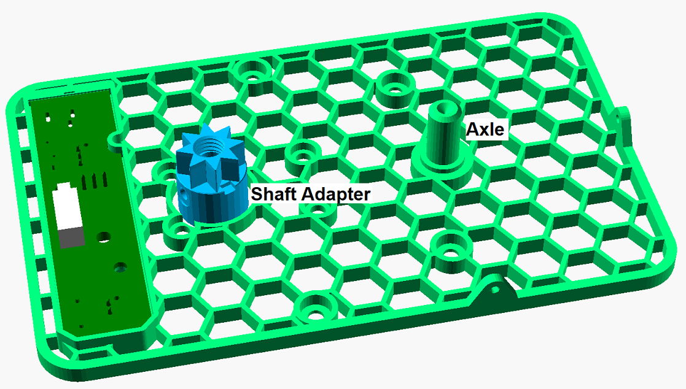
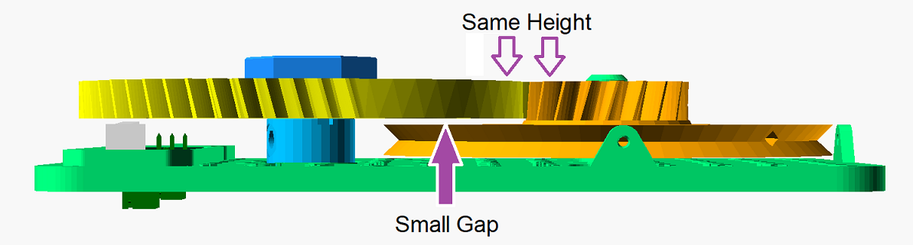

# Stupidly Simple Spider Dropper User Guide

Adrian McCarthy (2025)

## Setup

1.  Hang the mechanism from above using zip ties through the openings at the very edge of the honeycomb plate.  (If it can swing a little bit, that's actually good.)  You can hang it in "landscape" or "portrait" orientation to suit your space, just make sure the string runs through the guide on the edge closest to the floor.  Make sure the hooks or zip ties do not interfere with the mechanism.

2.  **Before** connecting power, ensure that the string is either wound properly around the spool or completely unwound.  If any part of the string is wrapped around the axle, a gear, or anywhere else, free it up first.  (See JAMS below.)

3.  The spider **must** be able to drop its full distance without interference.

    * Don't try to have it "land" on something.
    * Don't drop it near decorations that it could get tangled in.
    * Don't drop it on guests' heads.

## Motion Sensor

When you first apply power, the mechanism will run up to one full cycle until the spider is in the standby position.

When the motion sensor detects someone, the spider will drop and then climb back up to the standby position.  The entire cycle takes about 10 seconds.  The cycle repeats when motion is detected again.  If there's constant motion, the cycle will just keep running.

Secure the motion sensor to something rigid.  The housing has slots that accommodate zip ties for this purpose.  If you attach it to a fence that gets bumped or that shakes in the wind, you'll get false triggers.  The sensor housing has slots to accommodate zip ties.

The cap over the motion sensor can be unscrewed and swapped for alternate ones that change the detection zone.  You probably want to keep the one with the smallest hole.  If that's still too sensitive, you can place one piece of cellophane tape (e.g., Scotch tape) across the small hole.  A good way to limit the detection zone is to mount the sensor overhead, and looking straight down.

## Jams

If the spider fails to freely drop its full distance, the mechanism will almost certainly jam shortly thereafter.  (Though I have seen the mechanism recover from some jams.)

If you detect a jam early and disconnect the power, you can probably free it up before there's any damage.

There are two protections against the motor overheating if a complete jam persists.

1.  The 3D-printed shaft adapter is a sacrificial part.  Under the constant strain of a jam, it will deform, allowing the motor to run freely without actually driving the mechanism.  I've included a spare.

2.  The circuit has a "resettable" fuse.  If it gets too hot, it will cut the power to the motor.  When the fuse cools again, it will reconnect the power.  You don't need to replace the fuse or do anything to reset it other than give it time to cool off.  (If it cools off before the jam has been cleared, it may cut the power again.)

With these protections in place, it should be fine to let the spider dropper run unattended.  In the worst case, the spider will simply stop dropping, but the motor should not overheat.

## Clearing a Jam

1.  Make sure the power is disconnected.

2.  Remove the hub screw.

3.  Pull the drive gear off the shaft adapter.

4.  Pull the spool assembly off its axle.  (It may be tight.  Don't wiggle, just pull it straight.)

5.  Free up the string.

6.  If the motor shaft adapter has deformed, replace it.  (Hint if it pulls off easily or if you can spin it with your fingers, it's a goner.)

7.  Push the spool back onto the axle.  Make sure it's on all the way.  When you look at it from the edge, it should be perfectly parallel to the honeycomb plate, and the string guide holes should be perfectly centered with the center of the spool.

8.  Make sure the string is completely unwound and pulled as far as possible through the string guide.

9.  Slide the drive gear onto the shaft adapter so that the portion without teeth is closest to the small gear.  Check it from the edges.  The drive gear should be perfectly parallel with the honeycomb plate.  There should be a slight gap between the spool and the drive gear.  And the top edges of the two gears should be aligned.  Secure the drive gear with the hub screw.

10.  With the mechanism suspended, and the spider at its lowest position, reconnect the power.  Run it through a couple cycles to make sure there are no obstructions to a full drop.

